# Compliance Database Schema

```mermaid
erDiagram

    %% ── RULES DOMAIN (PortalApi owns, ComplianceApi reads) ─────────────────

    RulePack {
        Guid    Id          PK
        string  Name
        string  Sector
        bool    IsActive
    }

    Rule {
        Guid    Id          PK
        string  LogicalId   "PHI-001 · filtered unique when IsActive"
        string  Version     "semver"
        bool    IsActive
        string  PackId      FK
        enum    Category
        enum    EvalType    "Deterministic | Ai | Hybrid"
        enum    DefaultSeverity
        enum    Status
        json    ScopeJson   "channels · directions · senderRoles"
        json    LogicJson   "patterns / AI prompt"
        json    DefaultActionsJson
    }

    RegulatoryMapping {
        Guid    Id          PK
        Guid    RuleId      FK
        enum    Framework   "Hipaa | Hitech | FdaPart11"
        string  Citation    "45 CFR §164.502(a)"
        string  Requirement
    }

    PatternLibrary {
        Guid    Id          PK
        string  Name
        json    PatternsJson "regex · entityType · confidence"
    }

    %% ── ORGANISATION ────────────────────────────────────────────────────────

    OrgConfig {
        Guid    Id          PK
        string  Name
        string  Slug
        json    LicensedPacksJson
        string  PrivacyOfficerEmail
    }

    %% ── POLICY LAYER (PortalApi owns, ComplianceApi reads) ─────────────────

    Policy {
        Guid    Id          PK
        string  LogicalId   "filtered unique when IsActive"
        string  Version     "semver"
        bool    IsActive
        enum    Status
        enum    DefaultEnforcementMode
        json    ChannelScopeJson
        json    EscalationConfigJson
        string  CreatedBy
        string  ApprovedBy
    }

    PolicyRuleConfig {
        Guid    Id          PK
        Guid    PolicyId    FK
        Guid    RuleId      FK
        bool    Enabled
        enum    EnforcementModeOverride "nullable"
        enum    SeverityOverride        "nullable"
        enum    DegradedMode
        json    ActionOverridesJson
        json    ParamsJson
    }

    ExemptionGrant {
        Guid    Id          PK
        enum    ExemptionType  "Tpo | Emergency | Research ..."
        enum    Effect         "SkipRule | Downgrade | AllowWithLog"
        bool    IsActive
        datetime ExpiresAt
        string  ApprovedBy
        json    ConditionJson
    }

    ExemptionUsageLog {
        Guid    Id              PK
        Guid    ExemptionGrantId FK
        Guid    MessageId
        Guid    RuleId
        datetime ClaimedAt
    }

    %% ── PIPELINE (ComplianceApi owns) ───────────────────────────────────────

    CanonicalMessage {
        Guid    Id          PK
        enum    SourceChannel
        enum    Direction
        enum    Status
        string  SenderId
        string  SenderRole
        Guid    PolicyId    FK
        string  IngestHash  "SHA-256 · unique"
        string  AcsThreadId
        string  AcsMessageId
        datetime RetainUntil "HIPAA 6yr min"
    }

    MessageEnrichmentContext {
        Guid    Id          PK
        Guid    MessageId   FK
        bool    IamEnriched
        string  ConsentStatus
        bool    SenderIsCareTeamMember
        json    UnavailableContextsJson
    }

    MessageEvaluationResult {
        Guid    Id          PK
        Guid    MessageId   FK
        Guid    RuleId      FK  "exact Rule row used"
        string  RuleLogicalId   "PHI-001 – denorm for reporting"
        string  RuleVersion
        Guid    PolicyId    FK
        enum    EvalLane    "Deterministic | Ai | Hybrid"
        enum    Verdict     "Compliant | Violation | Uncertain"
        enum    ViolationSeverity
        double  Confidence
        json    EvidenceJson
        string  AiPromptSnapshot
    }

    MessageAction {
        Guid    Id          PK
        Guid    MessageId   FK
        Guid    TriggeredByEvaluationId "nullable FK"
        enum    ActionType  "Block | Alert | Redact | NotifyRealTime ..."
        bool    Succeeded
    }

    HumanReviewTask {
        Guid    Id                  PK
        Guid    MessageId           FK
        Guid    EvaluationResultId  FK
        Guid    RuleId              FK
        enum    Status  "Pending | UnderReview | Resolved"
        enum    Severity
        datetime DueAt
        string  AssignedTo
        enum    ReviewerVerdict
        bool    AiVerdictOverridden
    }

    MessageAuditRecord {
        Guid    Id          PK
        Guid    MessageId   FK
        enum    OverallVerdict
        string  IngestHash
        string  EvaluationHash
        string  EvaluationSignature "RSA/ECDSA"
        string  SigningKeyId
        Guid    PolicyId    FK
        json    RuleVersionsSnapshotJson
        bool    IsAccountableDisclosure "HIPAA §164.528"
        datetime RetainUntil
    }

    %% ── RELATIONSHIPS ───────────────────────────────────────────────────────

    RulePack            ||--o{ Rule                     : "contains"
    Rule                ||--o{ RegulatoryMapping         : "mapped to"
    Rule                ||--o{ PolicyRuleConfig          : "configured by"
    Policy              ||--o{ PolicyRuleConfig          : "contains"
    ExemptionGrant      ||--o{ ExemptionUsageLog         : "used in"

    CanonicalMessage    ||--o| MessageEnrichmentContext  : "enriched by"
    CanonicalMessage    ||--o{ MessageEvaluationResult   : "evaluated by"
    CanonicalMessage    ||--o{ MessageAction             : "actioned by"
    CanonicalMessage    ||--o{ HumanReviewTask           : "reviewed by"
    CanonicalMessage    ||--o| MessageAuditRecord        : "sealed by"
    MessageEvaluationResult ||--o| HumanReviewTask       : "triggers"
```

## Ownership

| Schema area | Migration authority | Runtime access |
|---|---|---|
| RulePack, Rule, RegulatoryMapping, PatternLibrary | PortalApi | PortalApi R/W · ComplianceApi R/O |
| OrgConfig, Policy, PolicyRuleConfig, ExemptionGrant | PortalApi | PortalApi R/W · ComplianceApi R/O |
| CanonicalMessage, Evaluation, Action, Review, Audit | ComplianceApi | ComplianceApi R/W |

## Key design decisions

- All PKs are **Guid v7** (time-ordered, client-generated)
- `Rule.LogicalId` and `Policy.LogicalId` have a **filtered unique index** on `IsActive = true` — only one active version per logical rule/policy at a time
- Pipeline tables (`CanonicalMessage`, `MessageEvaluationResult`, `MessageAction`, `MessageAuditRecord`, `ExemptionUsageLog`) are **append-only** — enforced in `ComplianceDbContext.SaveChanges()`
- `MessageAuditRecord` is cryptographically sealed (SHA-256 hash chain + RSA/ECDSA signature)
- `RetainUntil` on messages and audit records enforces **HIPAA 6-year minimum retention**
